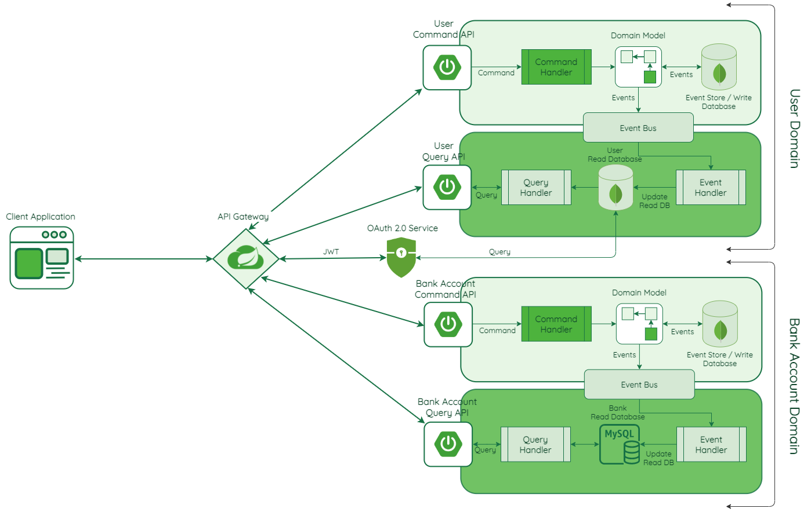
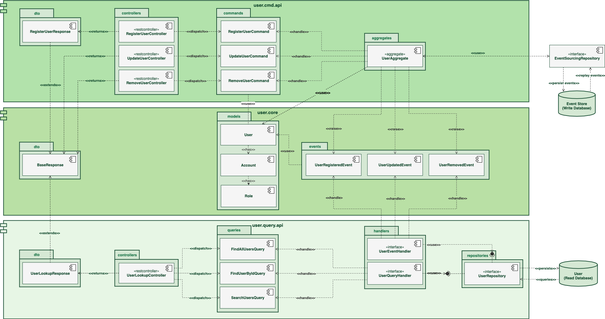
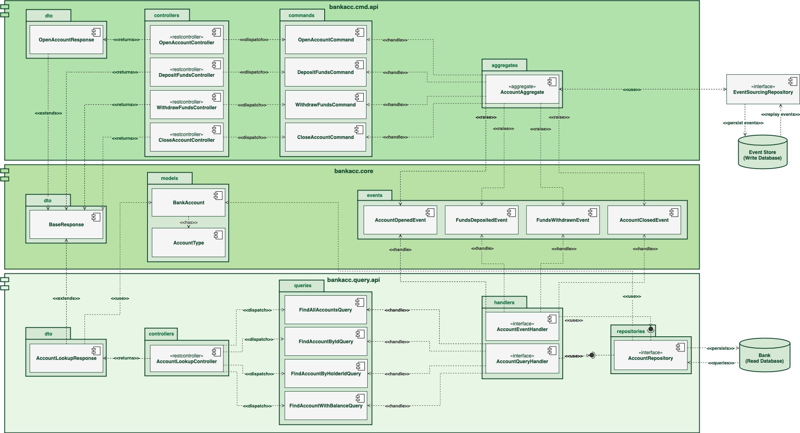

# User Manageemnt CQRS

This project demonstrates on how to set-up [CQRS](https://martinfowler.com/bliki/CQRS.html) in a Spring Boot application using [AxonIQ](https://axoniq.io).

This sample project is based on [Master Spring Boot Microservices with CQRS and Event Sourcing](https://www.udemy.com/course/master-spring-boot-microservices-with-cqrs-event-sourcing/) udemy course.


## How to Run the project and tests

### Application

There are 5 services in this demo:

- Api Gateway
- User Command API
- User Query API
- Bank Command API
- Bank Query API

<br/>




#### User Management

User Command API & User Command Query services




#### Bank Management

Bank Command API & Bank Command Query services



### Setup

- Clone this repository 

```
 git clone https://github.com/guedim/spring-projects.git
```

- Move to the directory `cqrs-axon/user-management`

```
cd spring-projects/cqrs-azon/user-management
```

### Build project & Docker images

- To build all services docker images (mongo, axon, mysql, user, bank, apigateway, etc,) run next command:
 
```
docker-compose build
```


### Start services 

For create, start and attach all containers, please run next docker-compose command:

```
 docker-compose up
```

### Test services

Finally, for running services import collection file [cqrs-axon.postman_collection.json]() into [Postman](https://www.postman.com/) application.
- Commands: Post Commands for user and bank services.
- Query: Post Queries for user and bank services.
- AuthServer: Authorization server for generate token. (Automatically called by Postman)
- ApiGateway: Samples for Post Commands and Queries using api gateway project.


# References

- https://martinfowler.com/bliki/CQRS.html
- https://www.udemy.com/course/master-spring-boot-microservices-with-cqrs-event-sourcing/