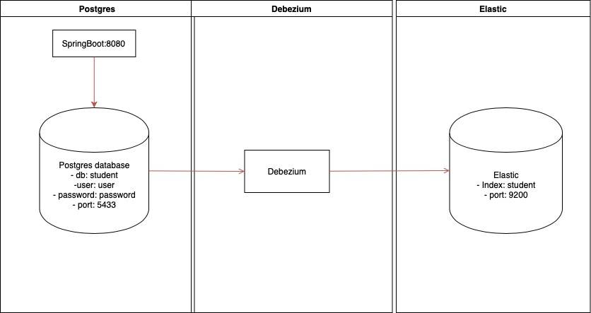

# Spring Boot debezium-demo

This project demonstrates on how to set-up debezium in a Spring Boot application.

This sample project is based on the post  [Change Data Capture (CDC) With Embedded Debezium and Spring Boot](https://dzone.com/articles/change-data-capture-cdc-with-embedded-debezium-and).


### Application

There is one services in this demo (a ``Spring Boot`` application) running in 8080 port.
- This application has a controller to save data in ``Postgres``.
- This project has ``debezium`` configuration to read data from ``Postgres`` logs and process.
- Finally, data are injected in ``elastic Search``.

<br/>




## How to Run the project and tests

### Run application

- Clone this repository 

```
 git https://github.com/guedim/spring-projects.git
```

- Move to the directory `debezium`

```
cd spring-projects/debezium
```

- Run the docker compose file `docker-compose.yml` for starting a postgres database and elasticsearch engine.

```
   docker-compose -f docker-compose.yml up -d
```

- Run spring boot application.

```
    ./mvnw spring-boot:run
```

- Open  url [http://localhost:8080/student/1](http://localhost:8080/student/1) in the browser or command line. 

```
curl http://localhost:8080/student/1
```

- Or run Postman collection `debezium.postman_collection.json`. 

All changes in Postgres will be notified in elasticSearch engine.


### Run Test
To run integration test, you don't need to run the docker compose file. Just run the test as follows:

```yaml
mvn test
```

The test uses [TestContainers](https://www.testcontainers.org/) to spin a postgres database, which is used during the integration test.