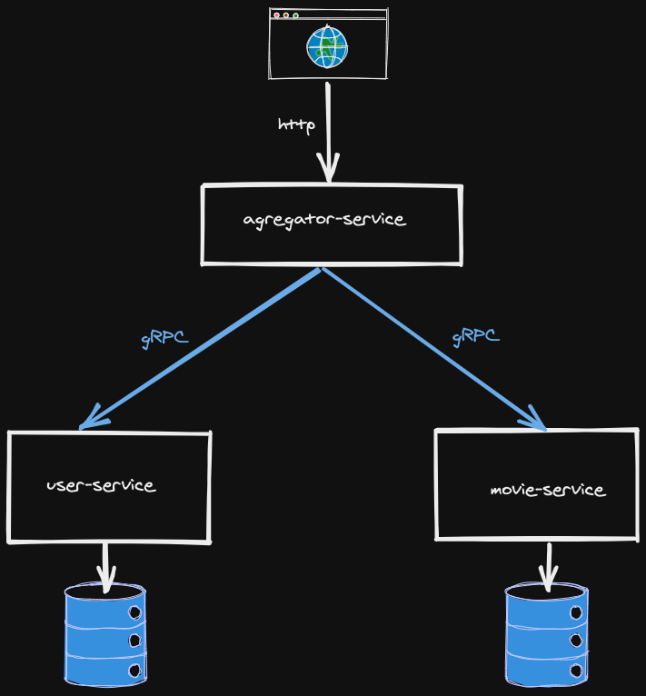

# SpringBoot gRPC

This project demonstrates on how to set-up [gRPC](https://grpc.io) in a Spring Boot application.

This sample project is based on [Microservices with gRPC [Java + Spring Boot  + Protobuf]](https://www.udemy.com/course/grpc-the-complete-guide-for-java-developers/) udemy course.


## How to Run the project and tests

### Application

There are 3 services in this demo:

- aggregator service: Is a HTTP Rest API using Spring Boot.
- user service: Is a gRPC service using Spring Boot with a ``H2 Database`` database.
- Item service: Is a gRPC service using Spring Boot with a ``H2 Database`` database.

<br/>




### Setup

- Clone this repository 

```
 git clone https://github.com/guedim/spring-projects.git
```

- Move to the directory `grpc-flix`

```
cd spring-projects/grpc-flix
```

### Build project & Docker images

- To build all services docker images (aggregator, user and movies) run next command:
 
```
docker-compose build
```


### Start services 

For create, start and attach all containers, please run next docker-componse command:

```
 docker-compose up
```

### Test services

Finally, ``aggregaror-service`` expose two methods
- ``/user/{loginId}``: GET http method for listing user recommended genre movies. This http method call gRPC ``user-service`` and ``movie-service``.
  - ``user-service``: Find user by loginId and returns user genre. 
  - ``movie-service``: Return all movies with same  genre.

For testing purposes, run next commands:
```
 curl --location --request GET 'localhost:8080/user/matico'
```

- ``/user/``: PUT http method for update user genre movies. This http method call gRPC ``movie-service``.

For testing purposes, run next commands:
```
 curl --location --request PUT 'localhost:8080/user/' --header 'Content-Type: application/json' --data-raw '{"loginId": "matico","genre": "DRAMA" }'
```

# References

- https://www.udemy.com/course/grpc-the-complete-guide-for-java-developers/
- https://github.com/guedim/grpc/tree/master/grpc-java-course
- https://www.vinsguru.com/reactive-grpc-in-java/git 
- https://2much2learn.com/mavengradle-based-multi-module-spring-boot-microservices/