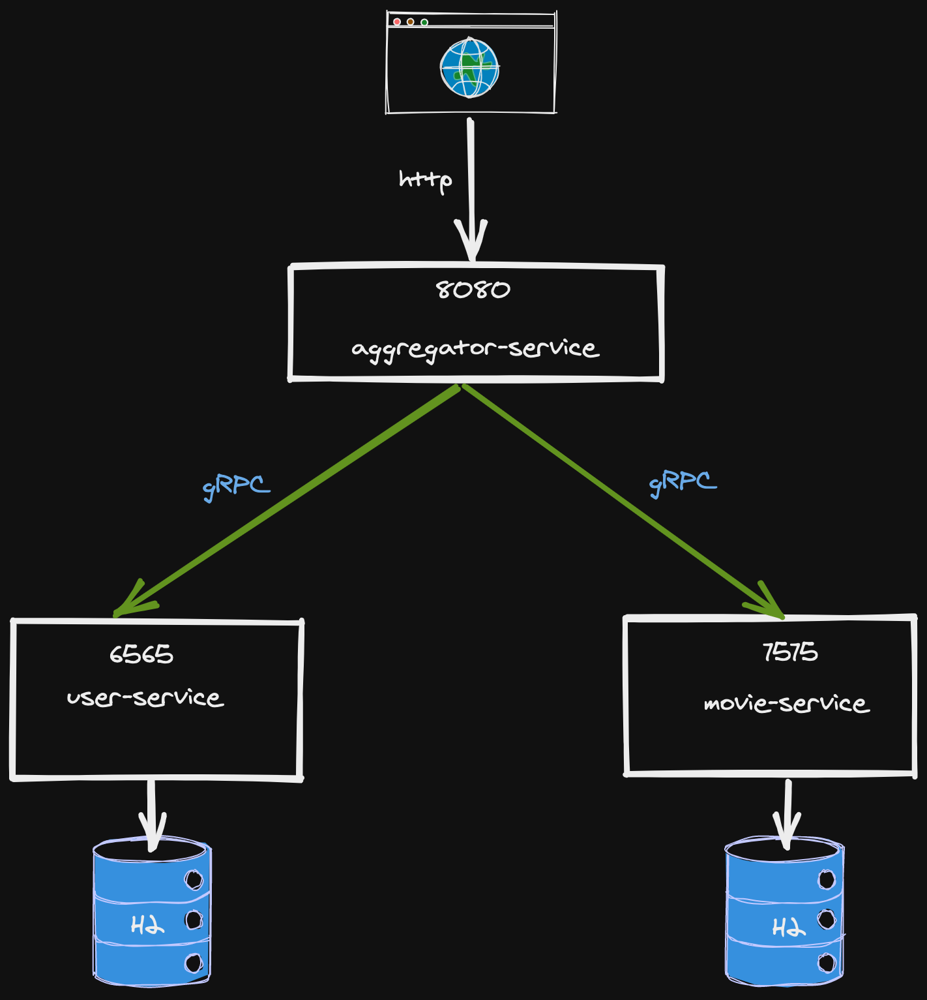

# SpringBoot gRPC

This project demonstrates on how to set-up [gRPC](https://grpc.io) in a Spring Boot application.

This sample project is based on [Microservices with gRPC [Java + Spring Boot  + Protobuf]](https://www.udemy.com/course/grpc-the-complete-guide-for-java-developers/) udemy course.


## How to Run the project and tests

### Application

There are 3 services in this demo:

- agregator service.
- user service: Use ``H2 Database`` database.
- Item service: uses ``H2 Database`` database.

<br/>




Each service is a Spring Boot project which uses non-mocked DB started by ``TestContainers`` library.  

- test-runner: Is a module to start ``User`` and ``Item`` services and their dependencies (``Postgeres`` & ``Redis``) in order  to perform end-to-end tests.


### Setup

- Clone this repository 

```
 git https://github.com/guedim/spring-projects.git
```

- Move to the directory `testcontainer`

```
cd spring-projects/testcontainer
```

### Build project & Docker images

- To build User and Item services and build docker images, run next script:
 
```
sh build-all.sh
```


### Run end-to-end tests

To run end-to-end tests go to `test-runner` project:

```
cd spring-projects/testcontainer/test-runner
```

Run `mvn test` for excuting end-to-end Test:

```
mvn test
```


# References

https://dzone.com/articles/easy-integration-testing-with-testcontainers
