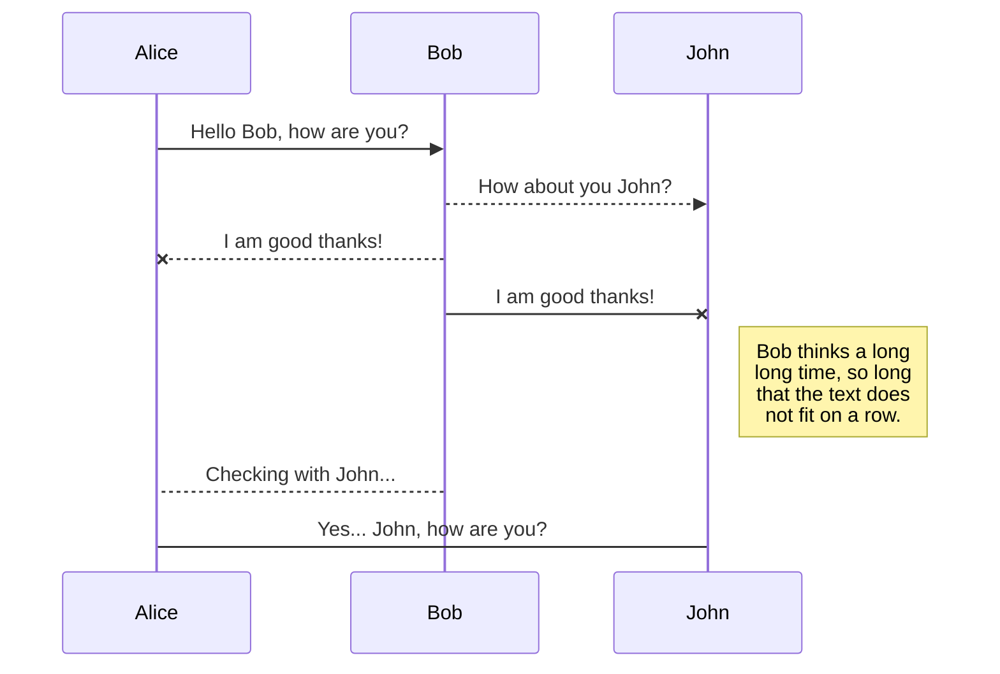

# SpringBoot TestContainer

This project shows how to set up an spring boot project for running Integration test using  [TestContainers](http://testcontainers.org) and [Wiremock](http://wiremock.org).


## Application Description

Next section shows application processing flow its dependencies:

### Application process flow:

Main goal for this project, is receive a HTTP Request and process following next steps:

1. **Persist request**: Save data request  with ``NEW`` state into database.

2. **Get merchant configurations**: Call an external web service to get the merchant configuration.

3. **Evaluate fraud**: If merchant has enabled fraud validation option, it calls Fraud Control web service (update the request to ``EVALUATED`` status in database). 

4. **WebHook for final state**: If merchant has enabled web hook notifications, it sends an http post to the merchant web page. (update the request  to ``NOTIFIED`` status in database).

**NOTE**:
- If one error occurs,  system update the record in ``ERROR`` state and return a HTTP response with error message. 


produce a sequence diagram:



### Application dependencies:

This project process a request using next 4  dependencies:

1. **ConfigurationService**: External rest web service for getting up merchant configurations. Implementation using declarative [Feign client](https://cloud.spring.io/spring-cloud-netflix/multi/multi_spring-cloud-feign.html).

2. **FraudControlService**: External rest web service for evaluation/scoring fraud risk. Implementation using Spring [RestTemplate](https://spring.io/guides/gs/consuming-rest/).

3. **MerchantWebHook**: External merchant web endpoint for receiving HTTP notifications. Implementation using Spring [RestTemplate](https://spring.io/guides/gs/consuming-rest/).

4. **DBMS**: Relational database managment system for persisting process flow and process result.  This project uses [Postgres](http://postgresql.org).


- User service: Use ``Postgres`` to persit data.
- Item service: uses ``Redis`` to persist data and depends on User service.

<br/>


Each service is a Spring Boot project which uses non-mocked DB started by ``TestContainers`` library.  

- test-runner: Is a module to start ``User`` and ``Item`` services and their dependencies (``Postgeres`` & ``Redis``) in order  to perform end-to-end tests.


### Setup

- Clone this repository 

```
 git https://github.com/guedim/spring-projects.git
```

- Move to the directory `testcontainer`

```
cd spring-projects/testcontainer
```

### Build project & Docker images

- To build User and Item services and build docker images, run next script:
 
```
sh build-all.sh
```


### Run end-to-end tests

To run end-to-end tests go to `test-runner` project:

```
cd spring-projects/testcontainer/test-runner
```

Run `mvn test` for excuting end-to-end Test:

```
mvn test
```


# References:

https://docs.pact.io/

https://spring.io/projects/spring-cloud-contract

http://wiremock.org/

https://dzone.com/articles/easy-integration-testing-with-testcontainers

https://sunshined.gitbooks.io/spring-cloud/spring_cloud_contract/spring_cloud_contract_wiremock.html

https://engineering.pivotal.io/post/faking_oauth_sso/

https://robintegg.com/2019/02/24/testing-spring-boot-applications-with-testcontainers-and-selenium-webdriver-part-three

https://blog.sandra-parsick.de/2020/05/21/using-testcontainers-in-spring-boot-tests-for-database-integration-tests/

