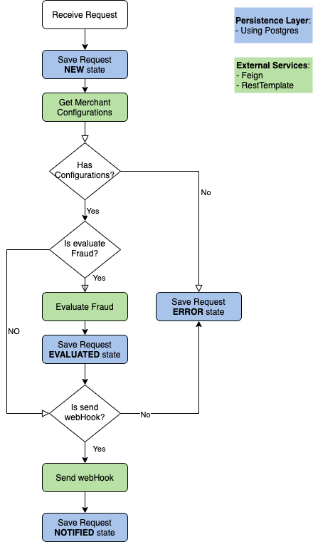
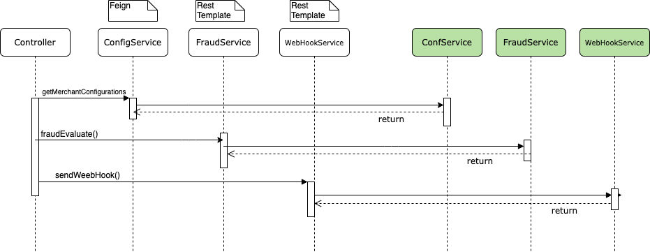

# SpringBoot TestContainer

This project shows how to set up an spring boot project for running Integration test using  [TestContainers](http://testcontainers.org) and [Wiremock](http://wiremock.org).


# Table of contents
1. [Application Description](#app_description)
    1. [Application process flow](#app_flow)
    2. [Application external dependencies](#app_dependencies)
2. [Integration Test](#integration_test)
	1. [JPA Layer](#jpa_test)
	2. [External Services](#services_test)
	3. [End to End Test](#context_test)  
3. [Setup Project](#setup_project)

4. [References](#references)


## Application Description<a id="app_description"></a>

Next section shows application processing flow its dependencies:

### Application process flow:<a name="app_flow"></a>

Main goal for this project, is receive a HTTP Request and process following next steps:

1. **Persist request**: Save data request  with ``NEW`` state into database.

2. **Get merchant configurations**: Call an external web service to get the merchant configuration.

3. **Evaluate fraud**: If merchant has enabled fraud validation option, it calls Fraud Control web service (update the request to ``EVALUATED`` status in database). 

4. **WebHook for final state**: If merchant has enabled web hook notifications, it sends an http post to the merchant web page. (update the request  to ``NOTIFIED`` status in database).

**NOTE**:
- If one error occurs,  system update the record in ``ERROR`` state and return a HTTP response with error message.

<p align="center">
  
</p>

### Application external dependencies:<a name="app_dependencies"></a>

This project process a request using next 4  dependencies:

1. **ConfigurationService**: External rest web service for getting up merchant configurations. Implementation using declarative [Feign client](https://cloud.spring.io/spring-cloud-netflix/multi/multi_spring-cloud-feign.html).

2. **FraudControlService**: External rest web service for evaluation/scoring fraud risk. Implementation using Spring [RestTemplate](https://spring.io/guides/gs/consuming-rest/).

3. **MerchantWebHook**: External merchant web endpoint for receiving HTTP notifications. Implementation using Spring [RestTemplate](https://spring.io/guides/gs/consuming-rest/).

4. **DBMS**: Relational database managment system for persisting process flow and process result.  This project uses [Postgres](http://postgresql.org).

<br/>

<p align="center">
  
</p>


## Integrations test<a id="integration_test"></a>

This section shows implementation integration test.

### JPA Layer<a id="jpa_test"></a>

Integration test using ``TestContainers``. Find implementation in [RepositoryIntegrationTest.java](https://github.com/guedim/spring-projects/blob/master/wiremock/src/test/java/com/guedim/wiremock/jpa/RepositoryIntegrationTest.java) class.

Header annotation class has configuration for running jpa integration test:

https://github.com/guedim/spring-projects/blob/0e93f37f870253d220de6c09df4234262255621b/wiremock/src/test/java/com/guedim/wiremock/jpa/RepositoryIntegrationTest.java#L30-L35

```java
@DataJpaTest
@AutoConfigureTestDatabase(replace = AutoConfigureTestDatabase.Replace.NONE)
@ContextConfiguration(initializers = RepositoryIntegrationTest.Initializer.class)
@TestMethodOrder(MethodOrderer.OrderAnnotation.class)
@Testcontainers
public class RepositoryIntegrationTest {
```

##### @DataJpaTest: 
- Annotation for a JPA test that focuses only on JPA components. 

##### @AutoConfigureTestDatabase(replace = AutoConfigureTestDatabase.Replace.NONE): 
- ``NONE`` configuration do not replace the application default DataSource.

##### @Testcontainers: 
- Annotation to find  all fields that are annotated with @Container and calls their container lifecycle methods.

##### @ContextConfiguration(initializers = RepositoryIntegrationTest.Initializer.class): 
- Spring Initializer for starting Postgres database container.

https://github.com/guedim/spring-projects/blob/0e93f37f870253d220de6c09df4234262255621b/wiremock/src/test/java/com/guedim/wiremock/jpa/RepositoryIntegrationTest.java#L131-L141


```java
protected static class Initializer implements ApplicationContextInitializer<ConfigurableApplicationContext> {
	@Override
	public void initialize(ConfigurableApplicationContext configurableApplicationContext) {
		TestPropertyValues
			.of("spring.datasource.url=" + postgreSQLContainer.getJdbcUrl(),
				"spring.datasource.username=" + postgreSQLContainer.getUsername(),
				"spring.datasource.password=" + postgreSQLContainer.getPassword())
			.applyTo(configurableApplicationContext);
	}
}
```


### External services<a id="services_test"></a>

Integration test using ``Wiremock``. Find implementation in [AbstractClientConfiguration.java](https://github.com/guedim/spring-projects/blob/master/wiremock/src/test/java/com/guedim/wiremock/client/AbstractClientConfiguration.java) class.

Header annotation class has configuration for web client integration test:

https://github.com/guedim/spring-projects/blob/0840b2ea53c4967dc32dafce564070be5e35bc87/wiremock/src/test/java/com/guedim/wiremock/client/AbstractClientConfiguration.java#L28-L34

```java
@ContextConfiguration(classes = { AbstractClientConfiguration.ContextConfiguration.class })
@SpringBootTest(
		properties = { "app.config-service.base-path=","app.fraud-service.base-path=http://localhost:${wiremock.server.port}/evaluate" }, 
		webEnvironment = SpringBootTest.WebEnvironment.RANDOM_PORT, 
		classes = {FraudEvaluationClient.class, WebHookClient.class, RestTemplate.class })
@AutoConfigureWireMock(port = 0, stubs = "classpath*:/wiremock/**/mappings/**/*.json", files = "classpath:/wiremock")
public class AbstractClientConfiguration {
```

##### @ContextConfiguration: 
- Define which Spring @Configuration to load.
- ContextConfiguration configuration class for prepare Feign clients and RestTemplateBuilder. 

##### @SpringBootTest: 
- This annotation allow us to create the ApplicationContext used in integration tests via SpringApplication.
- we override the external services base path for using ``WireMock`` endpoints.

##### @AutoConfigureWireMock: 
- Annotation to start a mock web server with our stubs and mapping definitions.


### End to End test<a id="context_test"></a>

End to End testing using ``Wiremock`` and ``TestContainers``. Find implementation in [AbtractIntegrationTest.java](https://github.com/guedim/spring-projects/blob/master/wiremock/src/test/java/com/guedim/wiremock/context/AbtractIntegrationTest.java) class.

Header annotation class has configuration for running End to End  test:

https://github.com/guedim/spring-projects/blob/0840b2ea53c4967dc32dafce564070be5e35bc87/wiremock/src/test/java/com/guedim/wiremock/context/AbtractIntegrationTest.java#L35-L39


```java
@ContextConfiguration(initializers = AbtractIntegrationTest.Initializer.class, classes = {AbtractIntegrationTest.LocalRibbonClientConfiguration.class })
@SpringBootTest(properties = { "app.config-service.base-path=","app.fraud-service.base-path=http://localhost:${wiremock.server.port}/evaluate"}, webEnvironment = WebEnvironment.RANDOM_PORT)
@AutoConfigureWireMock(port = 0, stubs = "classpath*:/wiremock/**/mappings/**/*.json", files = "classpath:/wiremock")
@Testcontainers
public class AbtractIntegrationTest {
```


##### @ContextConfiguration: 
- Define which Spring @Configuration to load.
- Initializer class set up a Postgres container. 
- LocalRibbonClientConfiguration class add wiremock port server for finding local endpoints.

##### @SpringBootTest: 
- This annotation allow us to create the ApplicationContext used in integration tests via SpringApplication.
- we override the external services base path for using ``WireMock`` endpoints.

##### @AutoConfigureWireMock: 
- Annotation to start a mock web server with our stubs and mapping definitions.


## Setup Project<a id="setup_project"></a>

- Clone this repository 

```sh
 git https://github.com/guedim/spring-projects.git
```

- Move to the directory `wiremock`

```
cd spring-projects/wiremock
```

### Run Integration Test

- For running integration test (using ``WireMock`` and  ``TestContainers`` with a  ``Postgres`` database) execute next command:
 
```sh
mvn test
```


## References:<a id="references"></a>

- https://docs.pact.io/

- https://spring.io/projects/spring-cloud-contract

- http://wiremock.org/

- https://dzone.com/articles/easy-integration-testing-with-testcontainers

- https://sunshined.gitbooks.io/spring-cloud/spring_cloud_contract/spring_cloud_contract_wiremock.html

- https://engineering.pivotal.io/post/faking_oauth_sso/

- https://robintegg.com/2019/02/24/testing-spring-boot-applications-with-testcontainers-and-selenium-webdriver-part-three

- https://blog.sandra-parsick.de/2020/05/21/using-testcontainers-in-spring-boot-tests-for-database-integration-tests/